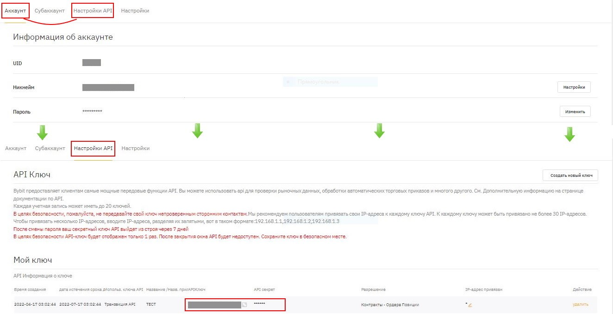
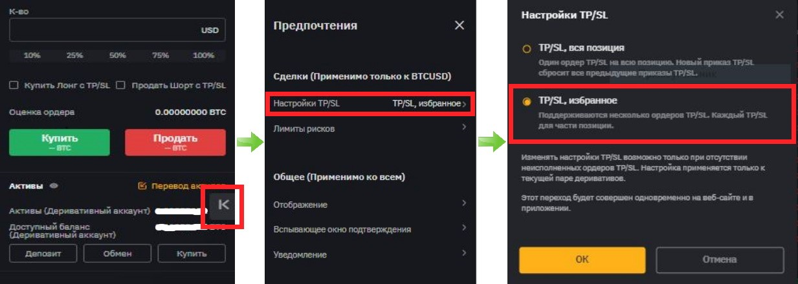
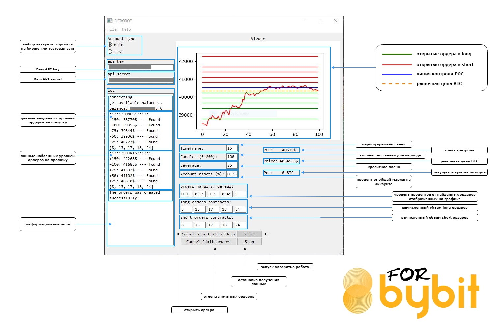
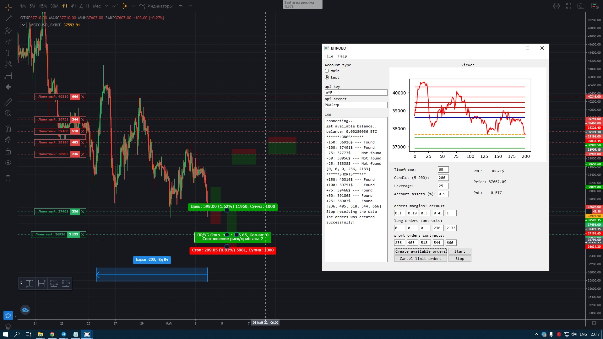
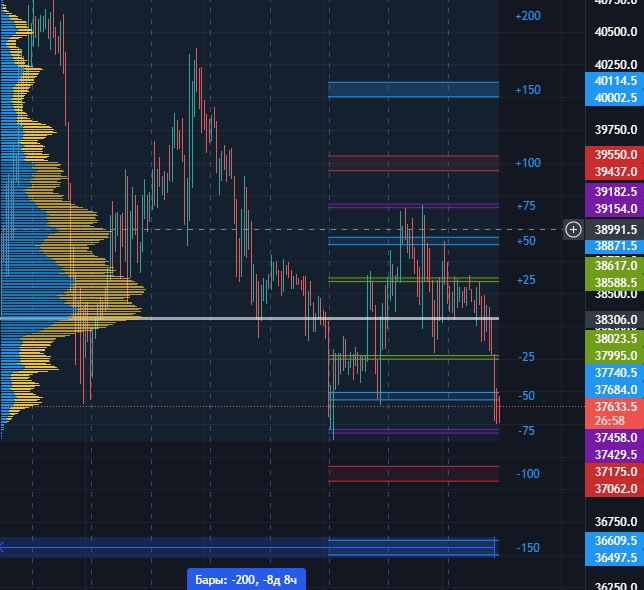
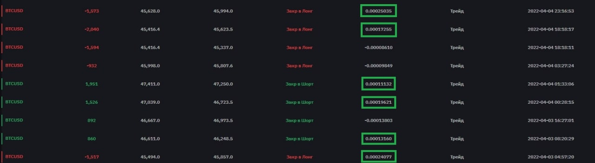

# Bitrobot
Данная программа для ОС Windows предназначена для торговли бессрочными инверсными контрактами на торговой валютной паре BTCUSD через торговую площадку BYBIT.   
Стек технологий: **python 3.10, pyqt6, numpy, pandas, matplotlib, requests, scipy, unittest, git**

# Руководство пользователя

**Содержание**
1. О программе
2. Настройка на сайте Bybit
3. Описание интерфейса и настройка робота.
4. Алгоритм программы
5. Потенциальная прибыль.
6. Обратная связь.

## 1. О программе
Данная программа для ОС Windows предназначена для торговли бессрочными инверсными контрактами на торговой валютной паре BTCUSD через торговую площадку BYBIT, полная версия позволяет торговать на основном и тестовом аккаунте, а демо версия только в тестовом режиме.

Главная особенность робота – это выявление ценового уровня BTC с наивысшим объемом торговли на основе выбранного периода времени и количества свечей c дальнейшим распределением ордеров от доступной маржи на аккаунте.
 
Необходима регистрация:
- Для торговли на основном счете - https://bybit.com   
- Для торговли в тестовом режиме - https://testnet.bybit.com

## 2. Настройка на сайте Bybit

Чтобы управлять ключами API, нажмите на "Аккаунт“,  далее  перейдите в "Настройки API".

В этом разделе Вы можете создать или удалить свои ключи API.
Полученные key API и secret API вводятся в предназначенные поля интерфейса программы BitRobot.
  
Программа рассчитана на открытие частичных лимитных ордеров, для изменения настроек TP&SL для нескольких ордеров нажмите символ стрелки скрытого меню, с правой стороны на странице графика, далее кликните значок шестеренки в правом верхнем углу страницы торговой платформы. В настройках TP&SL выберите "TP&SL, избранное".  

## 3. Описание интерфейса и настройка робота

-	**Account type**: main - режим полной версии программы, test - режим тестовой версии.
-	**API key** - ключ полученный от торговой площадки BYBIT.
-	**API secret** - пароль полученный от торговой площадки BYBIT.
-	В поле **Log** представлена информация: по данным найденных уровней ордеров на покупку и продажу с найденными лимитными позициями, вывод подсказок и ошибок из-за некорректно введённых данных.
-	**График** показывает найденные лимитные ордера (зелёная линия - long, красная линия - short). В зависимости от периода времени свечи и их количества для периода, алгоритм робота рассчитывает объемы покупок и продаж (синяя линия POC), рыночный курс BTC (жёлтая пунктирная линия).
-	**Timeframe** - период времени свечи, в тестовой версии доступны только D, W, M.  
  [1] - 1 minute  [3] - 3 minutes  [5] - 5 minutes  [15] - 15 minutes  [30] - 30 minutes  [60] - 1 hour  [120] - 2 hours  [240] - 4 hours  [360] - 6 hours  [720] - 12 hours  [D] - 1 day  [W] - 1 week  [M] - 1 month  
-	**Candles (5 - 200)** - количество свечей за период, выставленный в поле **Timeframe.**
-	**Leverage** - кредитное плечо на ордера.
-	**Account assets (%)** - процент от общего актива (маржи) на аккаунте (выставляется через точку), [0.1] -10%, [0.37] -37%, [0.9] -90%.
-	**Точка контроля (Point of Control или POC)** - ценовой уровень выбранного периода времени с наибольшем объемом торговли.
-	**Price** - рыночная цена BTC, получаемая в момент сбора данных с биржи.
-	**P&L**- прибыль или убыток нереализованного P&L в текущей открытой позиции.
-	**Orders margins: default** - установка уровня процентов для отображенных ордеров на графике. Установленная маржа в **Account assets**  распределяется для каждой из ячеек (слева направо) для вычисления **orders contracts** по принципу: первая ячейка - часть от маржи в процентах, вторая ячейка - процент от остатка расчитанной суммы контракта от первой ячейки и т.д. Ввод значений выставляется в следующем формате: [0.1] -10%, [0.19] -19%, [0.3] -30%, [0,45] -45%, [1] - 100%. Установки по умолчанию [0.1],[0.19],[0.3],[0.45],[1].
-	**Long orders contracts** - вычисленный алгоритмом робота объем ордеров на покупку. При отображении [0] позиция не будет открыта.
-	**Short orders contracts** - вычисленный алгоритмом робота объем ордеров на продажу. При отображении [0] позиция не будет открыта.
-	**Create available orders** - открыть вычисленные алгоритмом робота ордера на торговой площадке BYBIT
-	**Cancel limit orders** - отменить все лимитные ордера на торговой площадке BYBIT. Кроме открытого ордера, если он был исполнен.
-	**Start** - запуск алгоритма робота, вычисление по введенным данным наиболее подходящих условий.
-	**Stop** - остановка получения рыночной цены BTC и P&L (в случае открытой позиции).

## 4. Алгоритм программы

Алгоритм программы проделывает за Вас множество действий, так как на сайте BYBIT не представляется возможным работать с некоторыми индикаторами на графике напрямую.

BitRobot высчитывает и строит уровни для покупки/продажи контрактов относительно точки контроля (POC) по установленным параметрам.

Программа работает с максимальными ограничениями биржи с учетом найденных алгоритмом (max 5 long/short) для лимитных ордеров. Соотношение TP&SL взято 2:1 для каждого открытого ордера, SL берется как средняя цена между двумя ближайшими уровнями. Каждая открытая сделка берет только часть позиции при которой она исполняется.

Расчеты производятся по аналогии с существующими индикаторами на сайте tradingview.com для введенных параметров и отображается уровень POC вертикальных объемов, а также маржинальных уровней относительно запрашиваемых баров.

## 5. Потенциальная прибыль

Пример нескольких сделок по алгоритму: значимость уровня определяется его глубиной и соответственно этому устанавливается количество контрактов.

## 6. Обратная связь

Telegram -  @flareprj1  
Mail - cashbitrobot@gmail.com

